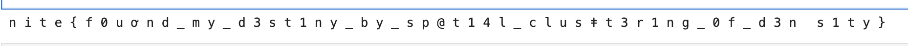

**Writeup for "Farewell Firewall" Challenge**

-----
**Challenge Interpretation**

The provided narrative about *"ancient villages"* and their methods of **visualizing positions** and **balancing energy flow** serves as a metaphor for the challenge steps. It alludes to concepts of **anomaly detection, balance, and interplay of opposing forces**. Let’s break this down to connect the narrative with the steps performed:

-----
**Step 1: DBSCAN for Outlier Detection (Mapping Villages)**

- The story begins with "visualizing the exact locations of counterpart villages, mapping their positions with precision."
- This correlates to **clustering the latitude and longitude coordinates** using DBSCAN.
- DBSCAN identifies dense regions of data points (villages) and flags anomalies (outliers) as isolated, hidden from the main clusters.
- These **outliers** represent **"hidden villages"** or tampered entries in the dataset.

By mapping outliers, we reveal points where manipulation occurred—this sets the stage for uncovering the hidden information.

```python
import pandas as pd
from sklearn.preprocessing import StandardScaler
from sklearn.cluster import DBSCAN
import matplotlib.pyplot as plt

# Load the dataset
df = pd.read_csv('Network_Log.csv')

# Extract the latitude and longitude columns
coordinates = df[['latitude_coord', 'longitude_coord']]

# Optional: Standardize the data (important for DBSCAN)
scaler = StandardScaler()
coordinates_scaled = scaler.fit_transform(coordinates)

# Apply DBSCAN
dbscan = DBSCAN(eps=0.1, min_samples=6)  # You can adjust eps and min_samples based on your data
df['outlier'] = dbscan.fit_predict(coordinates_scaled)

# 'outlier' column: -1 means an outlier, other values indicate cluster labels
outliers = df[df['outlier'] == -1]

# Save outliers to a new CSV file
outliers.to_csv('outliers.csv', index=False)

# Print outliers
print(f"Number of outliers: {len(outliers)}")
print(outliers)

# Plot the results
plt.scatter(df['latitude_coord'], df['longitude_coord'], c=df['outlier'], cmap='coolwarm', marker='o')
plt.title('Outlier Detection using DBSCAN')
plt.xlabel('Latitude')
plt.ylabel('Longitude')
plt.show()

```
found 58 outliers
-----
**Step 2: XORing data\_downloaded and data\_uploaded (Balancing Energy)**

- The story references *"balancing the flow of energy sent and received"*.
- This balance is represented by **data\_downloaded** (sent) and **data\_uploaded** (received).
- The use of the **XOR operation** symbolizes the "interplay of opposing forces" where two binary or numerical values interact to produce a **new result**.
- XOR is often used in cryptography to conceal or reveal information, acting as the interplay between **yin (negative)** and **yang (positive)** forces.

Performing XOR on the outlier rows ensures that manipulated or hidden information can be extracted. This step uncovers a new, transformed column.

```python 
import pandas as pd

# Step 1: Load the CSV file
df = pd.read_csv('outliers.csv')

# Step 2: Perform XOR operation and convert the result to ASCII
def xor_and_to_ascii(row):
    try:
        # Ensure the columns contain integer values for XOR operation
        data_downloaded = int(row['data_downloaded'])
        data_uploaded = int(row['data_uploaded'])
        
        # XOR the values
        xor_result = data_downloaded ^ data_uploaded
        
        # Convert XOR result to ASCII
        ascii_value = chr(xor_result)
        return ascii_value
    except ValueError:
        return ''  # In case of invalid data, return an empty string

# Apply the XOR and ASCII conversion function
df['xored_ascii'] = df.apply(xor_and_to_ascii, axis=1)

# Step 3: Save the result to a new CSV file
df.to_csv('xor.csv', index=False)
```
-----
**Step 3: Extracting ASCII Values (Revealing the Knowledge)**

- The story describes that the hidden knowledge *"could only be revealed through the interplay of opposing forces"*.
- XOR produces a numeric result, which, when converted to its **ASCII representation**, unveils readable characters.
- This transformation represents revealing the **hidden message** embedded in the tampered dataset.

The ASCII conversion exposes critical information that was previously obscured through manipulation.

-----
**Step 4: Sorting by user\_id (Order and Precision)**

- Finally, the narrative mentions *"mapping with precision"*.
- Sorting the results by user\_id aligns the extracted information in a meaningful order, ensuring that the hidden flag can be interpreted correctly.
- This step ensures the flag isn't scrambled or out of sequence.
-----
```python
import pandas as pd

# Load the dataset
df = pd.read_csv('xor.csv')

# Sort the DataFrame based on 'session_duration' column
df_sorted = df.sort_values(by='user_id', ascending=True)  # Change ascending to True for ascending order

# Save the sorted DataFrame to a new CSV file
df_sorted.to_csv('Sorted_Filtered_Network_Log1.csv', index=False)

# Print the first few rows of the sorted DataFrame
print(" ".join(df_sorted['xored_ascii'].astype(str)))

```


i tried to filter this data out by removing ascii out of range and removed the special charactars so got the flag wrong
**Conclusion**

The challenge cleverly uses anomaly detection, XOR operations, and ASCII decoding as metaphors for ancient systems of concealment and balance. By visualizing outliers (villages), balancing data flows (energy), and revealing the interplay of forces (XOR and ASCII), the hidden flag emerges.

The process mirrors the harmony of **yin and yang**: opposing forces interacting to reveal clarity and truth.

