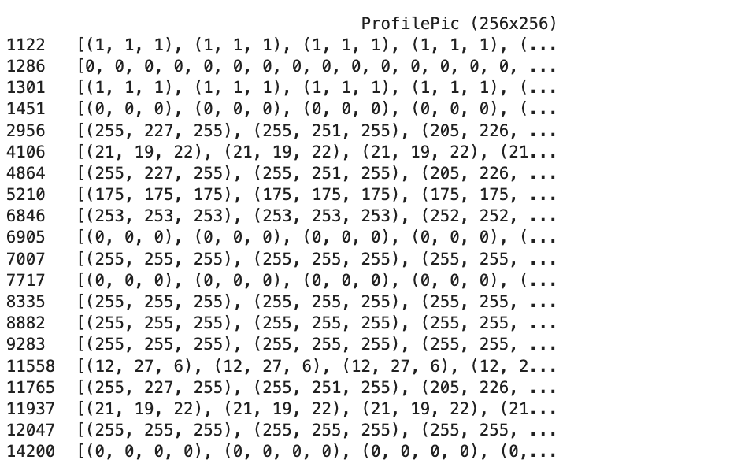
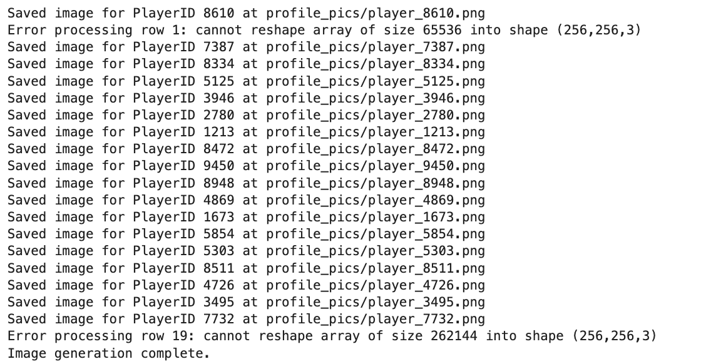
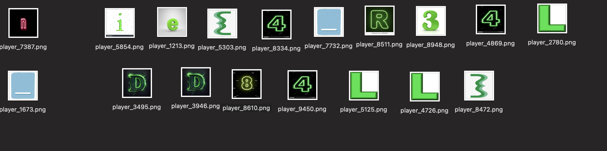

# **CTF Writeup: Glitch, Please!**

## Challenge Overview
The popular MMORPG *"All Alone in the Forest"* held an e-sports tournament, but controversy arose when 20 players were suspected of exploiting a glitch to overflow their inventories and achieve unrealistically low ping, gaining unfair advantages. The challenge was to uncover these cheating players and expose their profile pictures, which form letters of the flag.

---

## **Initial Approach**
The given dataset `datasetALLALONE.csv` contained the following columns:
- **PlayerID, GameSession, PlayerScore, ItemsCollected, ConnectionPing, SessionDuration, NumKills, Accuracy, NumDeaths, GameLevel, MaxCombo, WeaponType, NumBoosts, GameRegion, ProfilePic (256x256)**

### Step 1: Suspicious Player Detection Using AI Model
Initially, I created a basic AI model to identify outliers by analyzing numerical features such as:
- `ItemsCollected`
- `ConnectionPing`
- `PlayerScore`
- Other performance metrics like `K/D Ratio` and `Efficiency`

```python
import pandas as pd
import numpy as np
import matplotlib.pyplot as plt

# Load the dataset
df = pd.read_csv("datasetALLALONE.csv")

# Define thresholds
inventory_threshold = df['ItemsCollected'].quantile(0.95)  # 95th percentile
ping_threshold = 5  # Unrealistic low ping

# Flag suspicious players
df['Suspicious'] = (df['ItemsCollected'] > inventory_threshold) & (df['ConnectionPing'] < ping_threshold)

# Additional metrics
df['K/D_Ratio'] = df['NumKills'] / (df['NumDeaths'] + 1e-5)
df['Efficiency'] = df['PlayerScore'] / (df['SessionDuration'] + 1e-5)

# Analyze flagged players
suspicious_players = df[df['Suspicious']]
print(suspicious_players[['PlayerID', 'ItemsCollected', 'ConnectionPing', 'K/D_Ratio', 'Efficiency']])

# Visualize
plt.figure(figsize=(10, 6))
plt.scatter(df['ItemsCollected'], df['ConnectionPing'], c=df['Suspicious'], cmap='coolwarm', alpha=0.7)
plt.xlabel("Items Collected")
plt.ylabel("Connection Ping")
plt.title("Suspicious Players Analysis")
plt.colorbar(label="Suspicious (1=Yes, 0=No)")
plt.show()
```

### Key Insight: Pixel Array Size
On deeper inspection, I realized that the ProfilePic column contained pixel arrays. Each suspicious player’s profile picture, when reconstructed, revealed letters of the flag. I hypothesized that cheating players had a unique pixel array size of 65,536 (256x256 pixels flattened).

## Step 2: Filtering Pixel Arrays of Size 65,536
I filtered the dataset to identify rows where the pixel array had 65,536 elements.
```python
import pandas as pd
import ast
from tqdm import tqdm

# Load the dataset
file_name = "datasetALLALONE.csv"
df = pd.read_csv(file_name)

# Initialize a list to store rows
players_data = []

# Check ProfilePic size
for index, row in tqdm(df.iterrows(), total=df.shape[0], desc="Processing Profile Pics"):
    try:
        profile_pic_array = ast.literal_eval(row['ProfilePic (256x256)'])
        if len(profile_pic_array) == 256 * 256:
            players_data.append(row)
    except Exception as e:
        print(f"Error at index {index}: {e}")

# Convert to DataFrame
players_df = pd.DataFrame(players_data)
players_df.to_csv("flattened_players_65536.csv", index=False)
print("Filtered players saved to flattened_players_65536.csv")
```

## Step 3: Reconstructing Profile Pictures
With the filtered players’ pixel arrays, I generated images using Python libraries like PIL (Python Imaging Library) and NumPy.
```python
from PIL import Image
import numpy as np
import os
import ast
# Load filtered players
df = pd.read_csv("flattened_players_65536.csv")

output_dir = "profile_pics/"
os.makedirs(output_dir, exist_ok=True)

# Generate images
for index, row in df.iterrows():
    try:
        pixel_data = ast.literal_eval(row['ProfilePic (256x256)'])
        pixels_array = np.array(pixel_data, dtype=np.uint8).reshape((256, 256, 3))
        image = Image.fromarray(pixels_array, 'RGB')
        filename = f"{output_dir}player_{row['PlayerID']}.png"
        image.save(filename)
        print(f"Saved image for PlayerID {row['PlayerID']} at {filename}")
    except Exception as e:
        print(f"Error processing row {index}: {e}")
```
Result: This process generated the profile pictures of all 20 cheating players. When viewed, the images clearly revealed letters of the flag.
two images were not formed because they were not of form of rgb[(1,0,1),(1,0,1)...] but of rgba wrote a code for one missing letter 
```python
import pandas as pd
import ast
import json  # To save the array in JSON format

# Load the dataset
file_name = "flattened_players_65536.csv"  # Replace with your file name
df = pd.read_csv(file_name)

# Specify the PlayerID for which you want to extract the ProfilePic array
player_id_to_find = 9599  # Replace with the PlayerID you're interested in

# Find the row corresponding to the specified PlayerID
player_row = df[df['PlayerID'] == player_id_to_find]

if not player_row.empty:
    # Extract the ProfilePic column for the player
    profile_pic_data = player_row.iloc[0]['ProfilePic (256x256)']
    
    # Convert the string representation to an actual list (flattened array)
    try:
        profile_pic_array = ast.literal_eval(profile_pic_data)  # Convert string to list
        
        # Step 1: Save the extracted array in JSON format
        json_file_name = f"profile_pic_player_{player_id_to_find}.json"
        with open(json_file_name, 'w') as json_file:
            json.dump(profile_pic_array, json_file)  # Save array as JSON

        print(f"ProfilePic array for PlayerID {player_id_to_find} has been saved to {json_file_name}.")
        
        # Step 2: Optionally, save it as a plain text file (for inspection or other use)
        txt_file_name = f"profile_pic_player_{player_id_to_find}.txt"
        with open(txt_file_name, 'w') as txt_file:
            for row in profile_pic_array:
                txt_file.write(str(row) + '\n')  # Write each row of the array as a line in the file

        print(f"ProfilePic array for PlayerID {player_id_to_find} has also been saved to {txt_file_name}.")
        
    except Exception as e:
        print(f"Error processing the ProfilePic for PlayerID {player_id_to_find}: {e}")
else:
    print(f"PlayerID {player_id_to_find} not found in the dataset.")
```
and made its picture -
```python
import pandas as pd
import numpy as np
from PIL import Image
import ast

# Load the dataset
file_name = "flattened_players_65536.csv"  # Replace with your file name
df = pd.read_csv(file_name)

# Specify the PlayerID you want to generate an image for
player_id_to_find = 9599  # Replace with the PlayerID you're interested in

# Step 1: Find the row corresponding to the specified PlayerID
player_row = df[df['PlayerID'] == player_id_to_find]

# Step 2: Extract the ProfilePic column for the player
if not player_row.empty:
    profile_pic_data = player_row.iloc[0]['ProfilePic (256x256)']
    
    # Step 3: Convert the string representation to an actual list of values (flattened RGBA values)
    try:
        profile_pic_flattened = ast.literal_eval(profile_pic_data)  # Convert string to list
        
        # Step 4: Check if the array has the correct length (65536 elements for a 256x256 RGBA image)
        if len(profile_pic_flattened) == 65536:
            # Step 5: Reshape the array to a 256x256 image with 4 channels (RGBA)
            profile_pic_array = np.array(profile_pic_flattened, dtype=np.uint8)
            profile_pic_array = profile_pic_array.reshape((256, 256, 4))  # Reshaping to 256x256x4
            
            # Step 6: Create an image from the reshaped array using Pillow (RGBA mode)
            img = Image.fromarray(profile_pic_array, mode='RGBA')  # RGBA mode for 4 channels
            
            # Step 7: Save or display the image
            img.save(f"profile_pic_player_{player_id_to_find}.png")
            img.show()  # This will open the image using the default image viewer
            print(f"Image for PlayerID {player_id_to_find} has been saved as 'profile_pic_player_{player_id_to_find}.png'.")
        
        else:
            print(f"The flattened array does not have 65536 elements. It has {len(profile_pic_flattened)} elements.")
    except Exception as e:
        print(f"Error processing the ProfilePic for PlayerID {player_id_to_find}: {e}")
else:
    print(f"PlayerID {player_id_to_find} not found in the dataset.")
```

## Step 4: Sorting Images by PlayerScore
To sort the images based on player scores for better visualization:

```python
sorted_df = df.sort_values(by=['PlayerScore'], ascending=False)
print("Sorted players based on PlayerScore.")
```

## Final Outcome
- 20 Players Identified: By filtering pixel arrays of size 65,536, I identified all cheating players.
- Profile Pictures: The reconstructed images revealed letters, which formed the flag when arranged correctly.
- AI Model: Although I initially tried building a model for outlier detection, filtering based on array size proved to be the most effective solution.