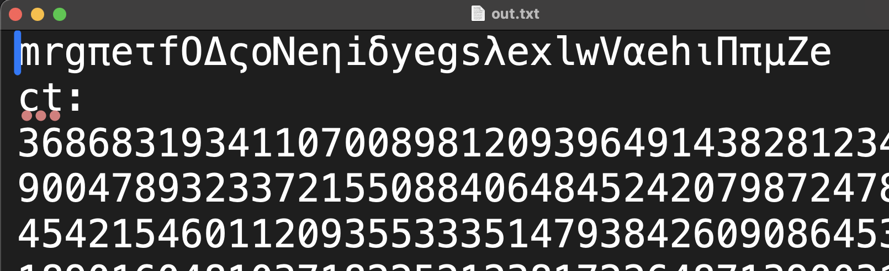
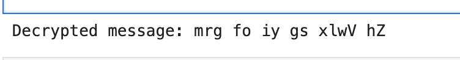
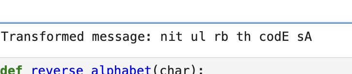
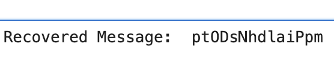
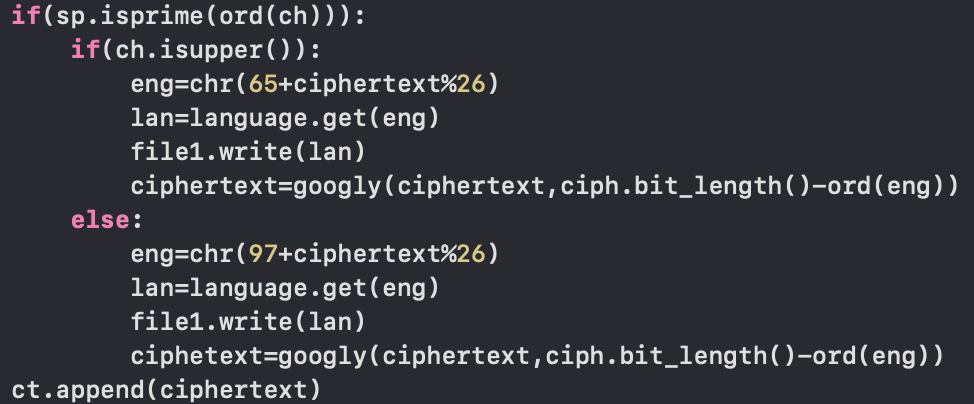
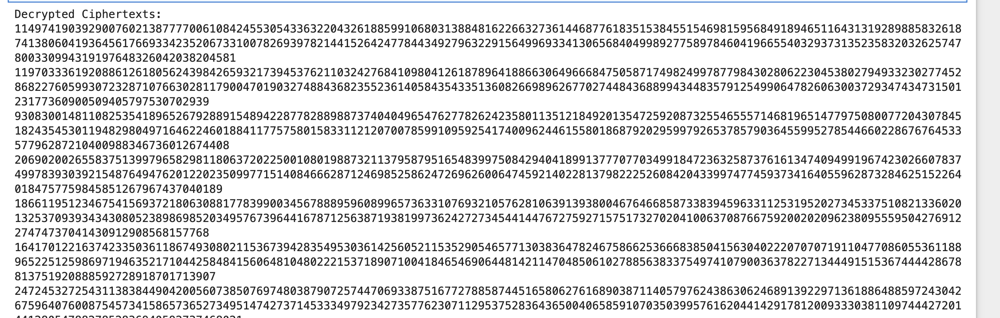
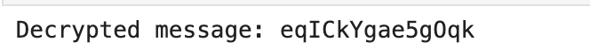
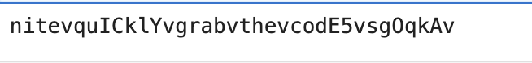
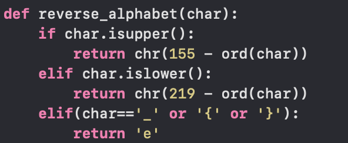

# Challenge: RSAabc

## Description

The "RSAabc" challenge presented an intriguing cryptographic puzzle, blending various encryption methods to hide a message. The task was to break the encryption and retrieve the hidden flag.

The provided files for the challenge were:
- **cipher.py**: A Python script implementing the encryption.
- **out.txt**: A file containing the encrypted message.

The problem hinted at the need to "flip out," which likely referred to reversing certain encryption steps. This clue pointed towards manipulation or modular arithmetic techniques, which are commonly used in RSA-like encryption schemes.

## Approach

Upon inspecting the `cipher.py`, it became apparent that the encryption was based on a combination of encryption techniques, including elements from RSA encryption. Given the structure of RSA, it is typically vulnerable to certain attacks if some of the parameters (like the public exponent or modulus) are improperly chosen or if certain patterns are visible in the encryption process.

My approach involved:
1. the algorithm performed differently based on whether the ascii of character in flagg.txt is prime or not.
the encryption was roughly like this-
## if was not prime
1. reversed and written in out.txt
2. rsa was implemented on its ascii and its ct and n values were written

## if prime
1. converted to greek
2. rsa was done on it
3. googly function was done 

so obviously letters in out.txt which were greek are corresponding characters in flag.txt which were prime

## i made 3 different files to handle the output-greek.txt,cipher.txt and modulus.txt
```python
def extract_data_from_outfile(input_file, greek_file, cipher_file, modulus_file):
    with open(input_file, 'r') as f:
        data = f.read()

    # Split the data based on 'ct:' and 'n:' labels
    parts = data.split("ct:")  # First part contains characters, second part contains 'ct' data
    characters = parts[0].strip()

    # The part after 'ct:' should be the list of cipher numbers
    ct_part = parts[1].split("n:")[0].strip()  # Everything between 'ct:' and 'n:'
    
    # Now we handle the case of large numbers separated by commas in ct_part
    ct_numbers = [int(num_str.strip()) for num_str in ct_part.split(',') if num_str.strip().isdigit()]

    # The part after 'n:' should be the list of modulus numbers
    n_part = parts[1].split("n:")[1].strip()
    
    # Now we handle the case of large numbers separated by commas in n_part
    n_numbers = [int(num_str.strip()) for num_str in n_part.split(',') if num_str.strip().isdigit()]

    # Write the extracted characters to greek.txt
    with open(greek_file, 'w', encoding='utf-8') as f:
        f.write(characters)

    # Write the cipher numbers to cipher.txt
    with open(cipher_file, 'w') as f:
        f.write(' '.join(map(str, ct_numbers)))

    # Write the modulus numbers to modulus.txt
    with open(modulus_file, 'w') as f:
        f.write(' '.join(map(str, n_numbers)))


# Usage
extract_data_from_outfile('out.txt', 'greek.txt', 'cipher.txt', 'modulus.txt')
```
2. first i removed these english letters these were the letters which are not prime also remove indices of these not prime vlaues from ct and n values also note the indices
```python
import json

# Read the greek.txt file and identify English letters
with open('greek.txt', 'r') as f:
    greek_text = f.read()

# Initialize an empty list to store indices of English letters
english_indices = []

# Loop through the greek text and find English letters
for index, char in enumerate(greek_text):
    if char.isalpha() and not char.isascii():  # Only English letters
        english_indices.append(index)

# Write the indices of English letters to index.txt
with open('index.txt', 'w') as f:
    for index in english_indices:
        f.write(str(index) + '\n')

# Read the cipher.txt and modulus.txt (JSON arrays)
with open('cipher.txt', 'r') as f:
    cipher_numbers = json.load(f)

with open('modulus.txt', 'r') as f:
    modulus_numbers = json.load(f)

# Remove elements in cipher_numbers and modulus_numbers at the indices in index.txt
for idx in sorted(english_indices, reverse=True):  # Remove from the end to avoid index shifting
    if idx < len(cipher_numbers):
        del cipher_numbers[idx]
    if idx < len(modulus_numbers):
        del modulus_numbers[idx]

# Write the updated arrays back to cipher.txt and modulus.txt
with open('cipher.txt', 'w') as f:
    json.dump(cipher_numbers, f)

with open('modulus.txt', 'w') as f:
    json.dump(modulus_numbers, f)

print("Process complete!")
```
3. performed reverse operation on them and got half the flag 
```python
import sympy as sp
from Crypto.Util.number import *
import math

# Helper Functions
def int_to_string(number):
    # This function converts a decrypted integer back to a string
    try:
        return number.to_bytes((number.bit_length() + 7) // 8, byteorder='big').decode('utf-8')
    except UnicodeDecodeError:
        # If decoding fails, return a placeholder or skip invalid characters
        return ''

def reverse_alphabet(char):
    if char.isupper():  
        return chr(155 - ord(char))  # Reverse for uppercase
    elif char.islower():  
        return chr(219 - ord(char))  # Reverse for lowercase
    elif char in ['{', '}', '_']:  # Handle special characters
        return ' '  # Assuming space for '_', '{', '}'

def reverse_greek_to_english(greek_char):
    # Mapping Greek characters back to English alphabet
    language = {
        'Α': 'A', 'α': 'a', 'Β': 'B', 'β': 'b', 'Σ': 'C', 'σ': 'c', 'Δ': 'D', 'δ': 'd',
        'Ε': 'E', 'ε': 'e', 'Φ': 'F', 'φ': 'f', 'Γ': 'G', 'γ': 'g', 'Η': 'H', 'η': 'h',
        'Ι': 'I', 'ι': 'i', 'Ξ': 'J', 'ξ': 'j', 'Κ': 'K', 'κ': 'k', 'Λ': 'L', 'λ': 'l',
        'Μ': 'M', 'μ': 'm', 'Ν': 'N', 'ν': 'n', 'Ο': 'O', 'ο': 'o', 'Π': 'P', 'π': 'p',
        'Θ': 'Q', 'θ': 'q', 'Ρ': 'R', 'ρ': 'r', 'Σ': 'S', 'ς': 's', 'Τ': 'T', 'τ': 't',
        'Υ': 'U', 'υ': 'u', 'Ω': 'V', 'ω': 'v', 'Ψ': 'W', 'ψ': 'w', 'Χ': 'X', 'χ': 'x',
        'Υ': 'Y', 'υ': 'y', 'Ζ': 'Z', 'ζ': 'z'
    }
    return language.get(greek_char, greek_char)

def rsa_decrypt(ciphertext, n, d):
    # RSA Decryption function
    return pow(ciphertext, d, n)

# Function to compute 'd' from 'e', 'p', and 'q' (private key exponent)
def compute_d(e, p, q):
    phi_n = (p - 1) * (q - 1)
    d = sp.mod_inverse(e, phi_n)
    return d

# Read the output file to get the ciphertext and n values
with open("out.txt", "r") as file:
    lines = file.readlines()

# Extracting the ciphertext and n values from the file
ciphertext_values = []
n_values = []

for i, line in enumerate(lines):
    if line.startswith("ct:"):
        ciphertext_values = [int(i.strip()) for i in lines[i+1].split(",") if i.strip()]
    elif line.startswith("n:"):
        n_values = [int(i.strip()) for i in lines[i+1].split(",") if i.strip()]

# Placeholder for the private key 'd' (you need to calculate it from p, q)
# Sample e value, replace with actual if necessary
e = 65537  # Common RSA exponent
decrypted_message = ""

# Example function to simulate retrieving p and q (replace with actual extraction or calculation)
def get_pq_for_n(n):
    # In practice, you need to factor 'n' to get 'p' and 'q'. 
    # You can use a library like sympy's factorint or other methods to factor large numbers.
    factors = sp.factorint(n)
    p, q = list(factors.keys())
    return p, q

# Decrypt all ciphertexts
for i, ciphertext in enumerate(ciphertext_values):
    n = n_values[i]
    
    # Compute p and q from n (or use known values if available)
    p, q = get_pq_for_n(n)
    
    # Compute the private key 'd'
    d = compute_d(e, p, q)
    
    # Decrypt the ciphertext using RSA
    decrypted_int = rsa_decrypt(ciphertext, n, d)
    
    # Convert decrypted integer to character
    decrypted_char = int_to_string(decrypted_int)
    
    # Skip empty decrypted characters (from failed decoding)
    if not decrypted_char:
        continue
    
    # Reverse alphabet transformation if necessary
    transformed_char = reverse_alphabet(decrypted_char)
    
    # Reverse Greek mapping if necessary
    final_char = reverse_greek_to_english(transformed_char)
    
    decrypted_message += final_char

print("Decrypted message:", decrypted_message)

```
```python
def reverse_alphabet(char):
    if char.isupper():  
        return chr(155 - ord(char))  # Reverse for uppercase
    elif char.islower():  
        return chr(219 - ord(char))  # Reverse for lowercase
    elif char in ['{', '}', '_']:  # Handle special characters
        return char  # Return as is for '_', '{', '}'
    else:
        return char  # Return other non-alphabet characters as is

def reverse_alphabet_on_message(message):
    transformed_message = ''
    for char in message:
        transformed_message += reverse_alphabet(char)
    return transformed_message

# Reverse alphabet on the decrypted message
final_message = reverse_alphabet_on_message("mrg fo iy gs xlwV hZ")
print("Transformed message:", final_message)
```


4. i have the greek letters of prime characters convert them to english
```python
# Define the original Greek-to-English mapping
language = {
    'A': 'Α', 'a': 'α',
    'B': 'Β', 'b': 'β',
    'C': 'Σ', 'c': 'σ',
    'D': 'Δ', 'd': 'δ',
    'E': 'Ε', 'e': 'ε',
    'F': 'Φ', 'f': 'φ',
    'G': 'Γ', 'g': 'γ',
    'H': 'Η', 'h': 'η',
    'I': 'Ι', 'i': 'ι',
    'J': 'Ξ', 'j': 'ξ',
    'K': 'Κ', 'k': 'κ',
    'L': 'Λ', 'l': 'λ',
    'M': 'Μ', 'm': 'μ',
    'N': 'Ν', 'n': 'ν',
    'O': 'Ο', 'o': 'ο',
    'P': 'Π', 'p': 'π',
    'Q': 'Θ', 'q': 'θ',
    'R': 'Ρ', 'r': 'ρ',
    'S': 'Σ', 's': 'ς',  
    'T': 'Τ', 't': 'τ',
    'U': 'Υ', 'u': 'υ',
    'V': 'Ω', 'v': 'ω',
    'W': 'Ψ', 'w': 'ψ',
    'X': 'Χ', 'x': 'χ',
    'Y': 'Υ', 'y': 'υ',
    'Z': 'Ζ', 'z': 'ζ'
}

# Reverse the dictionary to map Greek letters back to English
reverse_language = {v: k for k, v in language.items()}

# Open the Greek text file and read its contents
with open("greek.txt", "r", encoding="utf-8") as greek_file:
    greek_text = greek_file.read()

# Convert Greek text back to English
english_text = ''.join([reverse_language.get(char, char) for char in greek_text])

# Write the English text to a new file
with open("english.txt", "w", encoding="utf-8") as english_file:
    english_file.write(english_text)

print("Conversion complete! Check 'english.txt' for the result.")
```
```python
import json

# Load the ciphertext from the cipher.txt file
with open("updated_cipher.txt", "r") as cipher_file:
    cipher_content = cipher_file.read()

# Load the ciphertext list (which should be a JSON array)
try:
    ciphertext_list = json.loads(cipher_content)
except json.JSONDecodeError as e:
    print(f"Error loading JSON: {e}")

# Load the corresponding English characters from english.txt
with open("english.txt", "r") as eng_file:
    eng_content = eng_file.read().strip()

# Check that the lengths match
if len(ciphertext_list) != len(eng_content):
    print("Error: The number of ciphertext entries does not match the number of English characters!")
else:
    # Create a reverse mapping for the googly function
    def reverse_googly(number, position):
        mask = 1 << position
        return number ^ mask

    # Recover the original ciphertext and characters
    recovered_message = []

    for i in range(len(ciphertext_list)):
        # Get the ciphertext number and the corresponding English character
        cipher_text = ciphertext_list[i]  # Get each ciphertext number from the list
        eng = eng_content[i]  # Get the corresponding English character from the string

        # Ensure the character is valid before proceeding
        if len(eng) == 1:  # Only process valid single characters
            # Calculate the original ciphertext before the googly function was applied
            # Determine the bit length and the corresponding position from the character
            original_ciphertext = reverse_googly(cipher_text, cipher_text.bit_length() - ord(eng))

            # Now, handle upper or lower case based on the original character
            if eng.isupper():
                original_char = chr(65 + original_ciphertext % 26)  # Uppercase letter
            else:  # Lowercase letter
                original_char = chr(97 + original_ciphertext % 26)

            recovered_message.append(original_char)  # Append the recovered original character

    # Join the recovered characters to form the message
    recovered_text = ''.join(recovered_message)
    print("Recovered Message: ", recovered_text)
```


5. now i try to reverse this googly function


6. i have the final ciphertext and the lan values these are enough to reverse the xor 
```python 
import sympy as sp
import ast

def googly_reverse(ciphertext, eng):
    """
    Reverse the googly operation by flipping the bit at the specified position.
    
    :param ciphertext: The ciphertext to be decrypted
    :param eng: The English letter used to determine the bit position
    :return: Decrypted ciphertext
    """
    # Calculate the bit position based on the original implementation
    bit_position = ciphertext.bit_length() - ord(eng)
    
    # Create the mask and XOR to flip the bit back
    mask = 1 << bit_position
    return ciphertext ^ mask

def main():
    # Read the updated_cipher.txt file
    with open('updated_cipher.txt', 'r') as f:
        ciphertexts = ast.literal_eval(f.read())
    
    # Read the english.txt file
    with open('english.txt', 'r') as f:
        english_letters = f.read().strip()
    
    # Decrypt the ciphertexts
    decrypted_ciphertexts = []
    
    # Assuming the number of ciphertexts and English letters match
    for cipher, eng in zip(ciphertexts, english_letters):
        decrypted = googly_reverse(cipher, eng)
        decrypted_ciphertexts.append(decrypted)
    
    # Print or save the decrypted ciphertexts
    print("Decrypted Ciphertexts:")
    for dec in decrypted_ciphertexts:
        print(dec)
    
    # Optionally, save to a file
    with open('decrypted_ciphertexts.txt', 'w') as f:
        for dec in decrypted_ciphertexts:
            f.write(str(dec) + '\n')

if __name__ == "__main__":
    main()
```

7. after that i have the intermediate ciphertext 


8. performed reverse rsa to get the message 
```python
import sympy as sp

def int_to_string(number):
    """Convert integer back to string"""
    return number.to_bytes((number.bit_length() + 7) // 8, byteorder='big').decode('utf-8')

def rsa_decrypt(ciphertext, modulus):
    """
    Attempt to decrypt RSA ciphertext 
    
    Known parameters from the original encryption:
    - e = 65537 (public exponent)
    - Tries to find d (private exponent) using the given modulus
    """
    # Attempt to factor the modulus
    factors = sp.factorint(modulus)
    
    # Ensure there are exactly two prime factors
    if len(factors) != 2:
        print(f"Cannot factor modulus {modulus} into two primes")
        return None
    
    # Extract the two prime factors
    p, q = list(factors.keys())
    
    # Calculate Euler's totient function
    phi_n = (p - 1) * (q - 1)
    
    # Calculate private exponent
    try:
        d = sp.mod_inverse(65537, phi_n)
    except ValueError:
        print(f"Cannot find modular inverse for modulus {modulus}")
        return None
    
    # Decrypt the ciphertext
    try:
        decrypted_int = pow(ciphertext, d, modulus)
        return int_to_string(decrypted_int)
    except Exception as e:
        print(f"Decryption failed for ciphertext {ciphertext}: {e}")
        return None

def main():
    # Read ciphertexts
    with open('decrypted_ciphertexts.txt', 'r') as f:
        ciphertexts = [int(line.strip()) for line in f]
    
    # Read moduli
    with open('updated_modulus.txt', 'r') as f:
        moduli = eval(f.read())
    
    # Ensure we have matching number of ciphertexts and moduli
    if len(ciphertexts) != len(moduli):
        print("Mismatch between number of ciphertexts and moduli")
        return
    
    # Decrypt each ciphertext
    decrypted_message = ''
    for ct, n in zip(ciphertexts, moduli):
        decrypted_char = rsa_decrypt(ct, n)
        if decrypted_char:
            decrypted_message += decrypted_char
        else:
            decrypted_message += '?'
    
    print("Decrypted message:", decrypted_message)
    
    # Optional: Write to file
    with open('decrypted_output.txt', 'w') as f:
        f.write(decrypted_message)

if __name__ == '__main__':
    main()
```


9. combine them to get the flag
```python
def reverse_alphabet(char):
    if char.isupper():  
        return chr(155 - ord(char))  # Reverse uppercase letters
    elif char.islower():  
        return chr(219 - ord(char))  # Reverse lowercase letters
    elif char == '_' or char == '{' or char == '}':
        return 'e'  # Special case for '_' or '{' or '}'
    return char  # Return the character as it is if it doesn't meet any of the above conditions

def reverse_string(input_str):
    # Apply reverse_alphabet function on each character of the string
    return ''.join([reverse_alphabet(ch) for ch in input_str])

# Example string
input_str = "mrgefoeiyegsexlwVehZe"

# Apply the reverse operation on the entire string
result_str = reverse_string(input_str)
print("Reversed string:", result_str)
```

```python
def insert_chars_at_indices(str1, str2, indices):
    # Convert the string to a list to allow for modifications
    str1_list = list(str1)
    
    # Insert characters from str2 at the specified indices
    for i, index in enumerate(indices):
        if i < len(str2):  # Ensure we don't go beyond the length of str2
            str1_list.insert(index, str2[i])
    
    # Convert the list back to a string
    return ''.join(str1_list)

# Example usage:
str1 = "nitvulvrbvthvcodEvsAv"
str2 = "eqICkYgae5gOqk"
indices = [3, 5, 7, 8, 9, 11, 13, 15, 20, 26, 29, 30, 31, 32]

result = insert_chars_at_indices(str1, str2, indices)
print(result)
```

NOTE: v reversed to e corresponds to special characters because of this-

flag can be found as - 
```bash 
nite{quICklY_grab_the_codE5_sgOqkA}
```